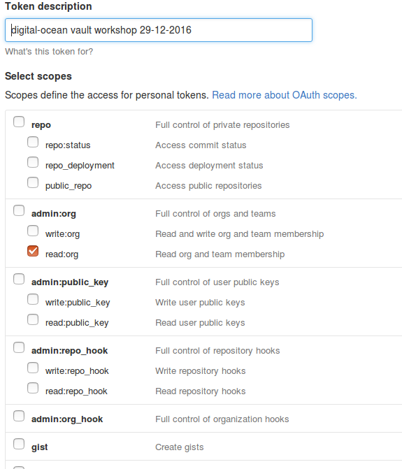

# Vault

[Vault by HashiCorp](https://www.vaultproject.io/) is a pretty cool for managing secrets. Something we all need a tool for these days with full automation of our infrastructure and when we script everything.

# Getting Vault running - taking it for a spin

Background: We met a few colleagues after Christmas for an informal litle sessions trying to use Vault for something useful for the first time.

## Two simple use-cases

We was looking into two simple use-cases. Shows in the following image, and explained below.

### Scripted access to secrets

When we write scripts, we would like to get secrets from Vault and use them.

* The process and use of the secrets should be - well secret, meaning unless we echo out the content of keys the should be hidden.
* We assume the computer, or environment, that need to talk to Vault will have a access token to use to get access to the secret. Distributing that access token is a another challenge.

### Password and secret lists

Today we have a list of secret we have outgrown. All our secrets are encrypted with a key phrase. We only have one, but should have more.
Using Vault for these secrets sharing seems easier.

* password list with several levels of access and secrets
* different user roles

## Spin up a Vault dev setup

**Notice a development setup of Vault is in-memory data, so nothing we do will be persisted.**

We used a Digital Ocean Droplet to run our Vault in a docker.
We used the following docker image as the official one didn't really work well due to internal port mismatches in a docker setup: https://github.com/sjourdan/docker-vault

### Started dev version of Vault in Digital Ocean

    docker-machine create --driver digitalocean --digitalocean-access-token=$DO vaulttest
      docker-machine env vaulttest
      eval $(docker-machine env vaulttest)
      docker run -d -p 8200:8200 --hostname vault --name vault sjourdan/vault
      docker logs -f vault

The `$DO` contains my Digital Ocean access token, that allows me to create Droplets there, that in the above is just used to run our container.

Reference output:

    $ docker-machine ls
    NAME         ACTIVE   DRIVER         STATE     URL                         SWARM   DOCKER    ERRORS
    vaulttest    *        digitalocean   Running   tcp://104.131.47.114:2376           v1.12.5

### Using it (use another terminal session)

Get Vault binary:

    wget https://releases.hashicorp.com/vault/0.6.4/vault_0.6.4_linux_amd64.zip
    unzip vault_0.6.4_linux_amd64.zip
    ./vault -h

Get to talk to our dev vault

    export VAULT_ADDR='http://104.131.47.114:8200'

_IP address is the docker machine ip - the port is 8200, not the port you get from docker-machine ls._

Using docker logs -f vault for the running Vault container, grep the root token.

    Reference output:
    $ docker logs -f vault
    ==> Vault server configuration:

    Backend: inmem
    Listener 1: tcp (addr: "0.0.0.0:8200", cluster address: "", tls: "disabled")
    Log Level: info
    Mlock: supported: true, enabled: false
    Version: Vault v0.6.1

    2016/12/29 12:35:46.583121 [INF] core: security barrier not initialized
    2016/12/29 12:35:46.583951 [INF] core: security barrier initialized shares=1 threshold=1
    2016/12/29 12:35:46.584138 [INF] core: post-unseal setup starting
    2016/12/29 12:35:46.587353 [INF] core: successfully mounted backend type=generic path=secret/
    2016/12/29 12:35:46.587384 [INF] core: successfully mounted backend type=cubbyhole path=cubbyhole/
    2016/12/29 12:35:46.587497 [INF] core: successfully mounted backend type=system path=sys/
    2016/12/29 12:35:46.588304 [INF] core: post-unseal setup complete
    2016/12/29 12:35:46.588464 [INF] core: root token generated
    2016/12/29 12:35:46.588473 [INF] core: pre-seal teardown starting
    2016/12/29 12:35:46.588502 [INF] rollback: starting rollback manager
    2016/12/29 12:35:46.588508 [INF] rollback: stopping rollback manager
    2016/12/29 12:35:46.588528 [INF] core: pre-seal teardown complete
    2016/12/29 12:35:46.588586 [INF] core: vault is unsealed
    2016/12/29 12:35:46.588610 [INF] core: post-unseal setup starting
    2016/12/29 12:35:46.588759 [INF] core: successfully mounted backend type=generic path=secret/
    2016/12/29 12:35:46.588781 [INF] core: successfully mounted backend type=cubbyhole path=cubbyhole/
    2016/12/29 12:35:46.588845 [INF] core: successfully mounted backend type=system path=sys/
    2016/12/29 12:35:46.589406 [INF] core: post-unseal setup complete
    ==> WARNING: Dev mode is enabled!

    In this mode, Vault is completely in-memory and unsealed.
    Vault is configured to only have a single unseal key. The root
    token has already been authenticated with the CLI, so you can
    immediately begin using the Vault CLI.

    The only step you need to take is to set the following
    environment variables:

    export VAULT_ADDR='http://0.0.0.0:8200'

    The unseal key and root token are reproduced below in case you
    want to seal/unseal the Vault or play with authentication.

    Unseal Key (hex)   : 9324d4bf621cb3436760e86d89594771f437a13c724b7f3a6d3f5918dfaaa276
    Unseal Key (base64): kyTUv2Ics0NnYOhtiVlHcfQ3oTxyS386bT9ZGN+qonY=
    Root Token: 641eab90-6f13-4b28-695b-5231eeded9c3

    ==> Vault server started! Log data will stream in below:

    2016/12/29 12:35:46.591853 [INF] rollback: starting rollback manager

So do the Vault auth using the `Root Token: 641eab90-6f13-4b28-695b-5231eeded9c3` from the above output.

Reference output:

    $ ./vault auth
    Token (will be hidden):
    Successfully authenticated! You are now logged in.
    token: 641eab90-6f13-4b28-695b-5231eeded9c3
    token_duration: 0
    token_policies: [root]

Check our status:

    $ ./vault status
    Sealed: false
    Key Shares: 1
    Key Threshold: 1
    Unseal Progress: 0
    Version: Vault v0.6.1
    Cluster Name: vault-cluster-74039490
    Cluster ID: de84a1a9-bf61-13ed-b2fe-b58bc24a197b

    High-Availability Enabled: false

### Creating users by enabling our Github ad directory

Enabling Github as our user directory:

    $ ./vault auth-enable github
    Successfully enabled 'github' at 'github'!
    bue@orange-one:~/vault-research$ ./vault write auth/github/config organization=praqma
    Success! Data written to: auth/github/config

### Policy

We need policy to be able to read and write stuff.

We are able to determine which rights the users have to specific URLs. In this case below, we are creating a policy for secret/*,  which means the users under this policy will be able to run all the CRUD actions on items named secret/something.

    $ cat policy.hcl
    path "secret/*" {
    policy = "write"
    }
    $ ./vault policy-write secret policy.hcl

### Giving team access to secrets

Giving team access to the path:

    $ ./vault write auth/github/map/teams/default value=secret
    Success! Data written to: auth/github/map/teams/default

    $ ./vault write auth/github/map/teams/praqma value=secret
    Success! Data written to: auth/github/map/teams/praqma

    $ ./vault write auth/github/map/teams/praqma value=default
    Success! Data written to: auth/github/map/teams/praqma

_The first command might not have been needed though, we copy pasted._

### Checking with my own user

Now instead of root I can change to my own user:

    ./vault auth -method=github token=$GH

The $GH contains my Github Access Token, created like in the image (Note the checkmark!)

### Accessing vault through docker

If you do not want to download and use binaries on your machine, you can use a temporary docker containers to run any vault commands.

First, export the address of the vault server:

    export VAULT_ADDR='http://104.131.47.114:8200'

Now you can run a temporary docker container, authenticating and then running your command.

    docker run -it --rm -e VAULT_ADDR --entrypoint=/bin/sh sjourdan/vault -c "vault auth -method=github token=$TOKEN &>/dev/null; vault status"

`$TOKEN` should be set to the token that will be authenticated. Replace the final vault command with whichever vault command you want to run.
You could for instance try vault write secrets/hello-world value=Hello followed by vault read secrets/hello-world to create and access your first secret.
